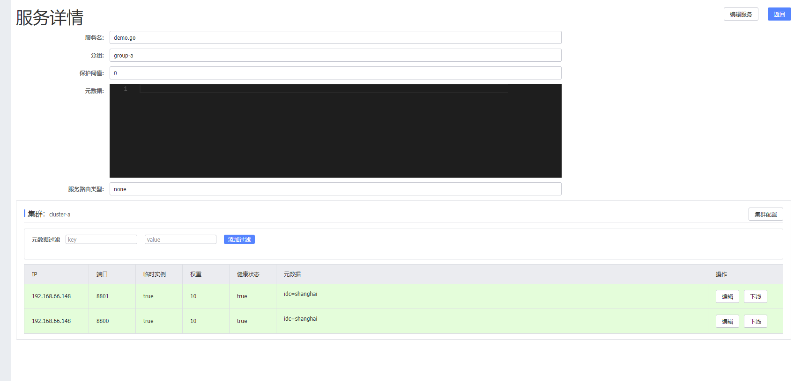

# gRPC+protobuf搭建的简单服务端注册到nacos中,并进行负载均衡测试

## protobuf生成的简单服务端
```
    #生成protobuf文件
    cd pb
    protoc --go_out=plugins=grpc:./ *.proto

    #运行命令安装包
    go mod init nacos_person
    go mod tidy

    #运行两个服务instance
    cd nacos-server8800
    go run nacos_server.go

    cd nacos-server8801
    go run nacos_server.go
```

## 查看nacos服务注册的状态


## 查看“服务详情” sdk获取服务信息


## 启动客户端测试负载均衡
```
    // 运行第一次访问的是 127.0.0.1:8800
    go run nacos_client.go 
    127.0.0.1:8800

    // 运行第一次访问的是 127.0.0.1:8801
    go run nacos_client.go 
    127.0.0.1:8801
```


